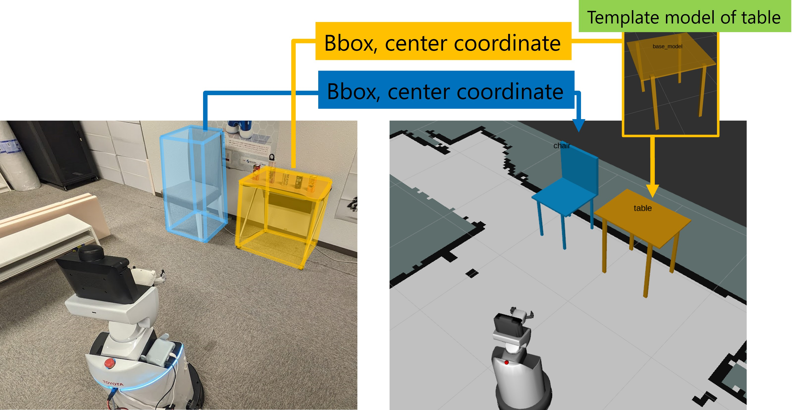

# Indoor Dynamic Map

- Our paper is available: [Unified Understanding of Environment, Task, and Human for Human-Robot Interaction in Real-World Environments](https://arxiv.org/abs/2412.13726)



## Environments

- OS: Ubuntu20.04
- ROS noetic
- CUDA: 11.7

## Docker support

- Please refer [this repository](https://github.com/yuzoo0226/omni3d_docker.git)

## How to build

```bash
mkdir -p <your_ros_ws>/src
cd <your_ros_ws>/src
git clone --recursive https://github.com/tamhome/tam_dynamic_map.git
catkin build
```

## How to use

### recognize furniture node

```bash
rosrun tam_dynamic_map recog_furniture_node.py
```

### Create world model (.yaml)

- Auto generation by recognize with OMNI3D

```bash
rosrun tam_dynamic_map create_world_model.py
```

- You can create/edit world model manually
- open [map](./io/map/sample.yaml) in your editor

```yaml
world:
- id: white_table
  type: table
  pose: {x: 3.75, y: 0.72, z: 0}
  scale: {x: 0.50, y: 0.75, z: 0.74}
# - id: object_id_as_you_like
#   type: chair # load furniture templates in ./io/furniture_templates/<>
#   pose: {x: 3.75, y: 1.72, z: 0}  # you can edit object pose
#   scale: {x: 0.50, y: 0.50, z: 1.00}
```

### Load world model

```bash
rosrun tam_dynamic_map load_world_model.py
```


## Use by launch

- If you want to use `sample.yaml` as a world model, you have to set `sample` as follows.

```xml
<arg name="world_model_name" default="sample"/>

<!-- world model 読み込み -->
<include file="$(find tam_dynamic_map)/launch/load_model.launch">
    <arg name="world_model_name" value="$(arg world_model_name)"/>
</include>
```

## 🙏 citation

```tex
@inproceedings{yano2024unified,
  title={Unified understanding of environment, task, and human for human-robot interaction in real-world environments},
  author={Yano, Yuga and Mizutani, Akinobu and Fukuda, Yukiya and Kanaoka, Daiju and Ono, Tomohiro and Tamukoh, Hakaru},
  booktitle={2024 33rd IEEE International Conference on Robot and Human Interactive Communication (ROMAN)},
  pages={224--230},
  year={2024},
  organization={IEEE}
}
```

- This work in licensed under the MIT license. To view a copy of this license, see [LICENSE](LICENSE).
